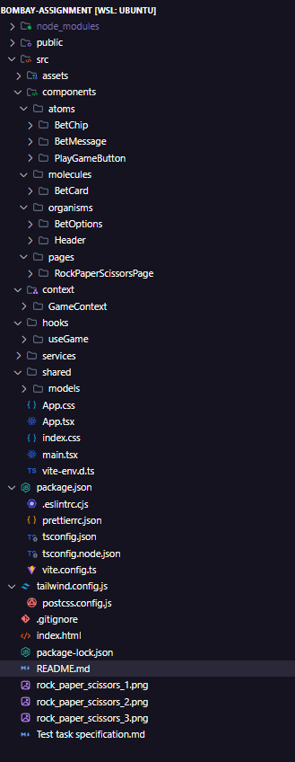
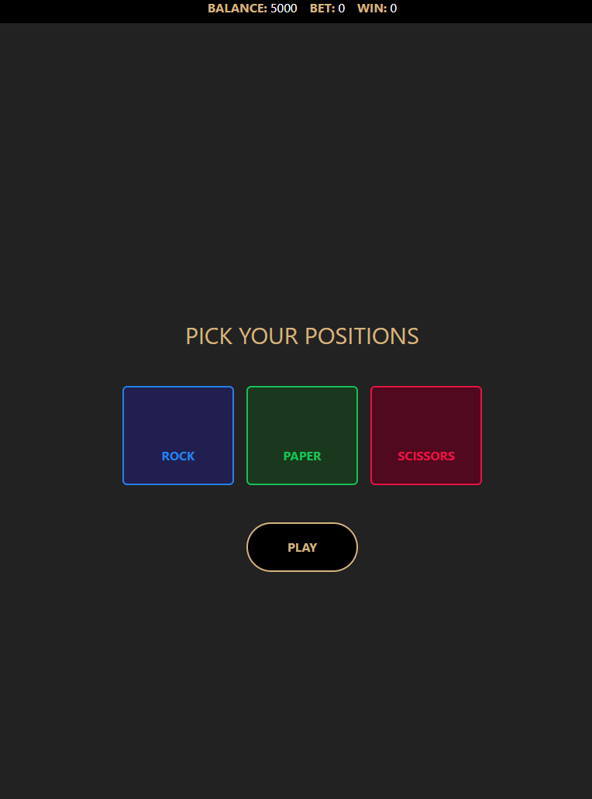
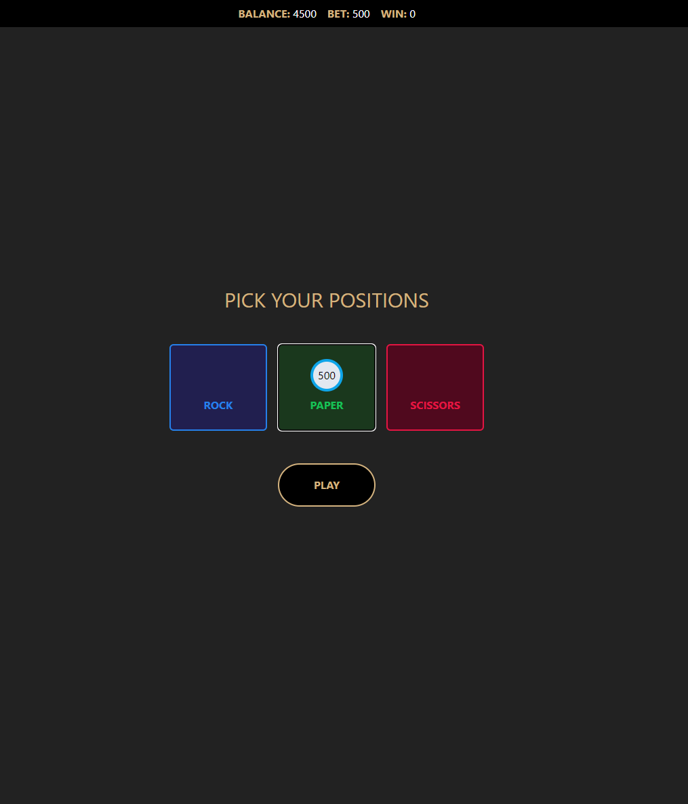
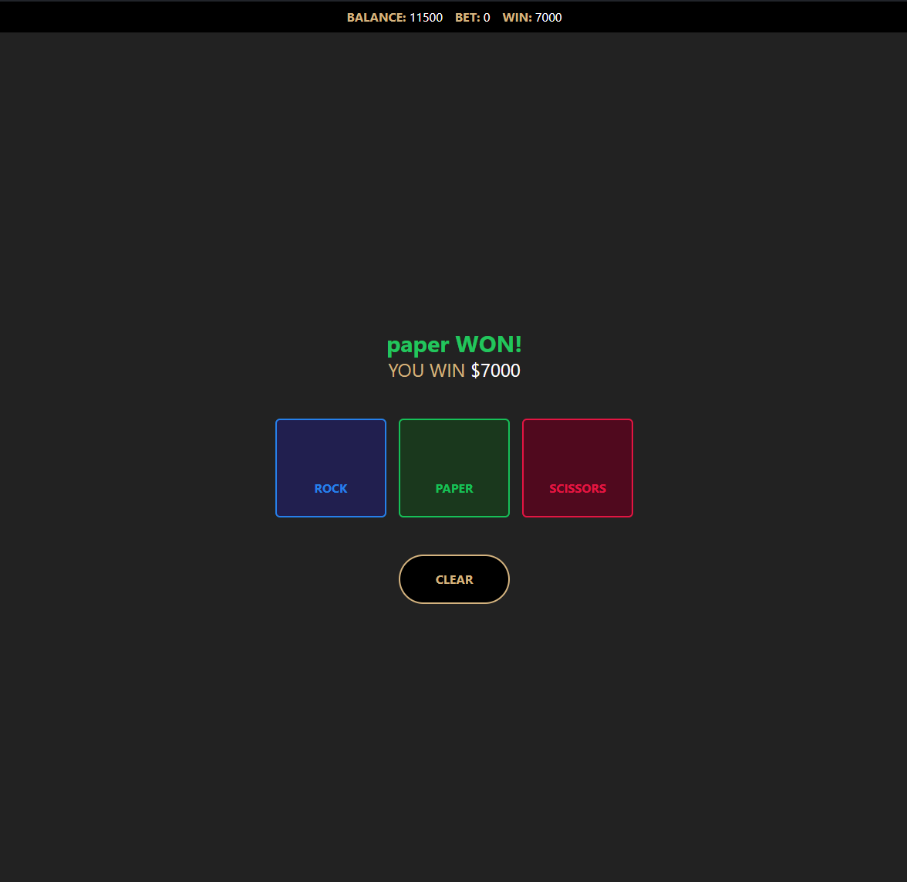

# Bombay Assignment

This project is the tech assignment for the Front-end developer position in the Bombay team.

Made by Lucas Visentin.

This project is made with React + TypeScript + Vite, you can find some important information below.

## Folder Structure



This is the folder structure of the project, in this project I decided to use ContextAPI together with a custom hook (useGame) to store the game information, such as bet amounts, which bets the user picked and etc.

## How it looks








## Notes

Because of the lack of APIs and real calculations (for example: deciding which was the computer choice in a backend), I added a setTimeout function which delays the showing of the result of the game, so the user can feel like its a real calculation for the result.

## Running Instructions

```bash
git clone git@github.com:lvisentin/bombay-assignment.git
cd bombay-assignment
npm i
npm run dev
```